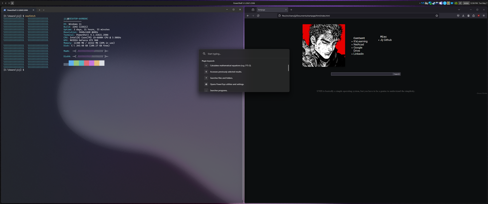

To setup powershell, Run as admin:
```
irm "https://github.com/jijtech/win/raw/main/setup.ps1" | iex
```

some tools i use on NT systems
* GlazeWM:              https://github.com/glzr-io/glazewm
* Chris titus debloat, Run as admin:
```
iwr -useb https://christitus.com/win | iex
```
* PowerToys:            https://learn.microsoft.com/en-us/windows/powertoys/ ( cant live without )

Microwin / microsoft adk-oscdimg
